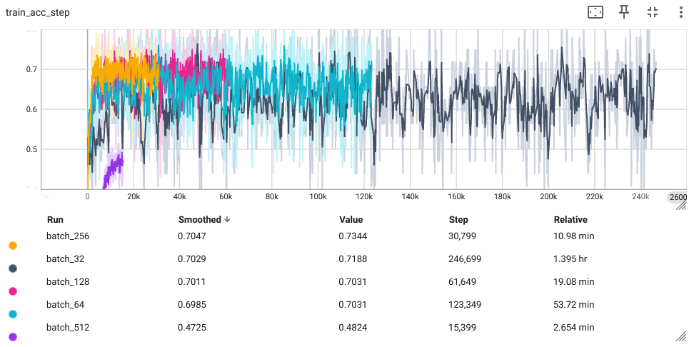
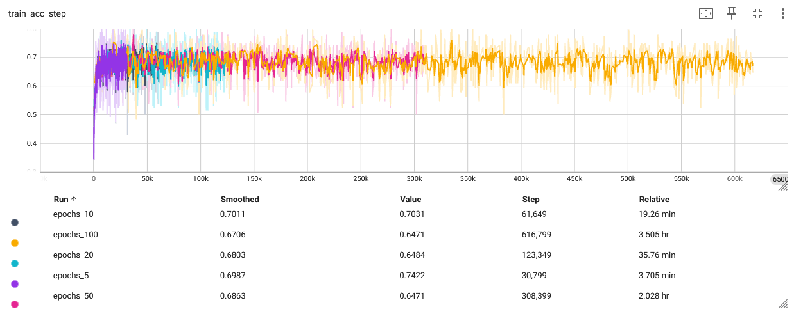

## Varying the Parameters
### 1. What is the impact of varying batch sizes and why?

Batch sizes of 10, 20, 50 and 100 will be tested using the `JSC-Tiny` model on the `JSC` dataset. All other hyperparamters are set to the default machop values most importantly - Learning Rate: 1e-5, Max Epochs: 20.

*Figure 1: Train Learning Curve with Different Batch Sizes*

Smaller batch sizes have a higher number of steps compared to larger batch sizes due to the need to perform more updates in a given epoch, hence the rate of change of accuracy is higher as batch size increases. Batch-sizes 32, 64, 128, 256 all have similar accuracy, achieving around 70%. The lines are noisy, indicating variance in accuracy from step to step, which is most prominent in smaller batch sizes, 32 and 64.

Modern hardware, particularly GPUs, are designed for parallel processing. Setting a larger batch size in training will maximise parallism, thus leading to a lower training runtime, if there is sufficient RAM/VRAM. This is extremely visible in this experiment, where a batch size of 32 takes over 90 minutes, whilst a batch-size of 512 takes just 2 minutes.

*Figure 2: Validation Learning Curve with Different Batch Sizes*

The validation accuracy figure shows a simlilar story, with little difference between training and validation accuracy. This would indicate litle overfitting and shows the model has sufficient training data to generalize well. A Batch-size of 256 is chosen since it performs best in both validation accuracy and runtime.

### 2. What is the impact of varying maximum epoch number?

*Figure 3: Train Learning Curve with Different Maximum Epcohs.*

Due to the size of the model relative to the training dataset, there is a higher amount of data for the model to learn without many repeated trainings of the dataset. Hence there are no signs of underfitting, even at 5 epochs. Increasing the maximum number of epochs beyond this point could lead to poor generalization as the model overfits to the training data. 10 epochs is more than sufficient to train the model, however early stopping could be employed to mitigate the effects of overfitting. 

### 3. What is happening with a large learning and what is happening with a small learning rate and why? What is the relationship between learning rates and batch sizes?

*Figure 4: Train Learning Curve with Different Learning Rates.*

Learning rate dictates the step size that is taken to reach a minimum of a loss function during trainingduring stochastic gradient descent. Too high a learning rate can lead to spikey training curves and a model that converges to a local minima, rather than the global minima, particularly in a non-convex optimisation problem. Too low a learning curve, results in a longer runtime for the model to converge. 

*Figure 5: Validation Learning Curve with Different Learning Rates.*
The highest learning rate of 1e-3 shows to perform well here, although there is a marinal decrease in performance overtime. Thus 1e-4 could be considered the optimal learning rate as it converges on the final accuracy in a smoother manner.

Adaptive learning rates can accelerate training whilst ensuring strong convergence and could be employed.

Smaller batch sizes might require more updates and hence more epochs to converge, which can be computationally expensive despite the faster per-update computation. A larger learning rate with small batches can accelerate convergence but at the risk of overshooting minima. Conversely, larger batches can utilize larger learning rates to potentially speed up convergence, but this can lead to suboptimal solutions if the learning rate is not adjusted appropriately. For this model, a batch-size of 256 and a learning rate of 1e-3 prevents significant overshooting whilst still converging quickly. 

