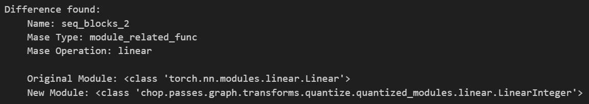
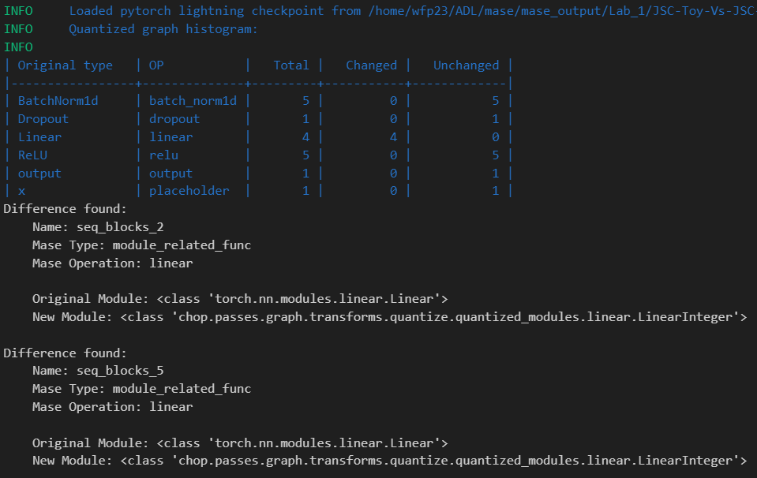
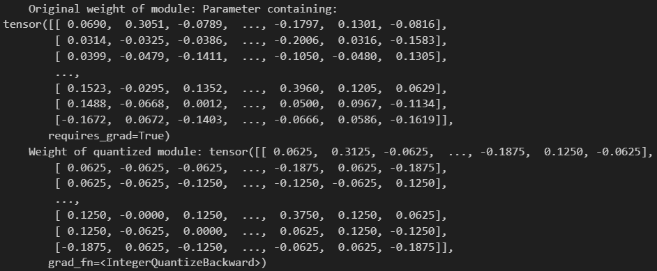

# LAB 2
## Turning you network to a graph
### 1. Explain the functionality of report_graph_analysis_pass and its printed jargons such as placeholder, get_attr … You might find the doc of torch.fx useful.

* As well as the other graph analysis passes, `add_common_metadata_analysis_pass` and `init_metadata_analysis_pass`, the `report_graph_analysis_pass` function generates a report for the Mase graph analysis and prints out an overview of the model in a table.
* It does not modify the graph like a tranform pass would, but outputs to the file if one is provided as an input otherwise prints to the console.
* It counts the different node operation types and module types found in the graph
* The graph contains sequence blocks which describes the Mase operators. For JSC_Tiny this would include BatchNorm1d, ReLU, Linear, ReLU with their respective parameters. 
* `Placeholders` correspond to the function parameters in the graph printout, in this lab's case the target 'x' and just represents a function input. 
* The `get_attr` operation is used to retrieve a specific attribute or parameter from a module.
* The `call_function` refers to the use of standalone, user-defined or built-in functions in the computation graph. If you define a function like myadd(x, y) which adds two values, and you use this function in your model, the FX symbolic tracer will represent this as a call_function node. The function is not bound to any particular object or module. It's a 'free' function that takes inputs and produces an output, independent of any object's state.
* The `call_module` encapsulates both data (parameters, states) and methods (like the forward method). When call_module is used, it's calling the forward method of that module with the given arguments.
* The `call_method` represents a method call on an object and is bound to the tensor object.

### 2. What are the functionalities of profile_statistics_analysis_pass and report_node_meta_param_analysis_pass respectively?

* `profile_statistics_analysis_pass` is a function used to gather and analyze statistical data from a graph related to weights and activations in the graph. The analysis methods such as `VariancePrecise` and `RangeQuantile` can be found in `stat.py`.
* `report_node_meta_param_analysis_pass` performs meta parameter analysis on the nodes in the graph, such as those passed to `profile_statistics_analysis_pass` and generates a report of this analayisis. In the `which` paramter selects either: `Common` which lists tensors with its shape, precision etc., `hardware` describing hardware based anaylsis and  `software` which shows paramters such as the `range_quantile` and `variance_precise`. 

## A deeper dive into the quantisation transform
### 3. Explain why only 1 OP is changed after the quantize_transform_pass.
Based on the configuration specified in `pass_args`, only modules of the `linear` type are impacted by the quantization transformation due to the `pass_args` whilst the other modules types are not modified. Other `QUANTIZEABLE_OP` could have been modified such as `relu`, `conv1d` etc. 

### 4. Write some code to traverse both mg and ori_mg, check and comment on the nodes in these two graphs. You might find the source code for the implementation of summarize_quantization_analysis_pass useful.
A function is written to traverse two graphs by their nodes and compare their differences.
```python
def compare_two_graphs_pass(ori_mg, mg):
    # Iterate through corresponding nodes in two graphs using zip
    for mg_node, ori_mg_node in zip(mg.fx_graph.nodes, ori_mg.fx_graph.nodes):
        
        # Check if the types of the actual targets of the nodes are different
        if (type(get_node_actual_target(mg_node)) != type(get_node_actual_target(ori_mg_node))):
            
            # Get the types of the original and new modules
            original_module = get_node_actual_target(ori_mg_node)
            quant_module = get_node_actual_target(mg_node)
            
            # Print a message indicating a difference is found
            print(f'Difference found:')
            print(f'    Name: {mg_node.name}')  # Print the name of the node
            print(f'    Mase Type: {get_mase_type(mg_node)}')  # Print the Mase Type of the node
            print(f'    Mase Operation: {get_mase_op(mg_node)}\n')  # Print the Mase Operation of the node
            print(f'    Original Module: {type(original_module)}')
            print(f'    New Module: {type(quant_module)}\n')  # Print module type differences
```
This returns an output, indicating that the new model's linear layer has indeed been modified.

*Figure 1: Graph Comparison After Quantization of `JSC-Tiny`.*

### 5. Perform the same quantisation flow to the bigger JSC network that you have trained in lab1. You must be aware that now the `pass_args` for your custom network might be different if you have used more than the `Linear` layer in your network.
The code to quantise the new model `jsc-will` is very similar to the implementation of `jsc-tiny` shown in lab 2. 
```python
# create a MaseDataModule using the `jsc` dataset and new model written in lab1
batch_size = 256
model_name = "jsc-will"
dataset_name = "jsc"

data_module = MaseDataModule(
    name=dataset_name,
    batch_size=batch_size,
    model_name=model_name,
    num_workers=0,
)
data_module.prepare_data()
data_module.setup()

# Import new checkpoint from JSC-Will
CHECKPOINT_PATH = "/home/wfp23/ADL/mase/mase_output/Lab_1/JSC-Toy-Vs-JSC-Will/jsc-will_classification_jsc_2024-01-28/software/training_ckpts/best.ckpt"
model_info = get_model_info(model_name)
model = get_model(
    model_name,
    task="cls",
    dataset_info=data_module.dataset_info,
    pretrained=False)

model = load_model(load_name=CHECKPOINT_PATH, load_type="pl", model=model)

# get the input generator
input_generator = InputGenerator(
    data_module=data_module,
    model_info=model_info,
    task="cls",
    which_dataloader="train",
)

# a demonstration of how to feed an input value to the model
dummy_in = next(iter(input_generator))
_ = model(**dummy_in)

# generate the mase graph and initialize node metadata
mg = MaseGraph(model=model)

mg, _ = init_metadata_analysis_pass(mg, None)
mg, _ = add_common_metadata_analysis_pass(mg, {"dummy_in": dummy_in})
mg, _ = add_software_metadata_analysis_pass(mg, None)

pass_args = {
    "by": "type",
    "default": {"config": {"name": None}},
    "linear": {
        "config": {
            "name": "integer",
            # data
            "data_in_width": 8,
            "data_in_frac_width": 4,
            # weight
            "weight_width": 8,
            "weight_frac_width": 4,
            # bias
            "bias_width": 8,
            "bias_frac_width": 4,
        },
        }
    }

ori_mg = MaseGraph(model=model)
ori_mg, _ = init_metadata_analysis_pass(ori_mg, None)
ori_mg, _ = add_common_metadata_analysis_pass(ori_mg, {"dummy_in": dummy_in})

mg, _ = quantize_transform_pass(mg, pass_args)
summarize_quantization_analysis_pass(ori_mg, mg, save_dir="quantize_summary")
compare_two_graphs_pass(ori_mg, mg)
```

*Figure 2: Graph Comparison After Quantization of `JSC-Will`. N.B. For Clarity, the Output is Cropped So that Only the First 2 of 4 Differences are Displayed.*

Evident from the graph, after employing quantization for `JSC-Will`, each of the 4 Linear layers are modified as expected. 
### 6. Write code to show and verify that the weights of these layers are indeed quantised. You might need to go through the source code of the implementation of the quantisation pass and also the implementation of the [Quantized Layers](../../machop/chop/passes/transforms/quantize/quantized_modules/linear.py).
The `compare_two_graphs_pass` function has been modified to demonstrate that the weights of each of the Linear layers have indeed been quantized.
```python
def compare_two_graphs_pass(ori_mg, mg):
    # Iterate through corresponding nodes in two graphs using zip
    for mg_node, ori_mg_node in zip(mg.fx_graph.nodes, ori_mg.fx_graph.nodes):
        
        # Check if the types of the actual targets of the nodes are different
        if (type(get_node_actual_target(mg_node)) != type(get_node_actual_target(ori_mg_node))):
            
            # Get the types of the original and new modules
            original_module = get_node_actual_target(ori_mg_node)
            quant_module = get_node_actual_target(mg_node)
            
            # Print a message indicating a difference is found
            print(f'Difference found:')
            print(f'    Name: {mg_node.name}')  # Print the name of the node
            print(f'    Mase Type: {get_mase_type(mg_node)}')  # Print the Mase Type of the node
            print(f'    Mase Operation: {get_mase_op(mg_node)}\n')  # Print the Mase Operation of the node
            print(f'    Original Module: {type(original_module)}')
            print(f'    New Module: {type(quant_module)}\n')  # Print module type differences
            
            # Get the precision and types of the weights of the nodes from their metadata
            mg_precision = mg_node.meta["mase"].parameters["common"]["args"]["weight"]["precision"]
            ori_mg_precision = ori_mg_node.meta["mase"].parameters["common"]["args"]["weight"]["precision"]

            mg_type = mg_node.meta["mase"].parameters["common"]["args"]["weight"]["type"]
            ori_mg_type = ori_mg_node.meta["mase"].parameters["common"]["args"]["weight"]["type"]

            print(f"    Original Node: {ori_mg_node.name}\tPrecision: {ori_mg_precision}")
            print(f"    Original Node: {ori_mg_node.name}\tType: {ori_mg_type}\n")

            print(f"    New Node: {mg_node.name}\tPrecision: {mg_precision}")
            print(f"    New Node: {mg_node.name}\tType: {mg_type}")
            
            '''
            The functionality to update the meta information for that entry is not implemented yet.
            Since quantization happens "on-the-fly", after the forward is executed).
            As discussed with the TAs, manually quantizing the weights using the method 
            _LinearBase(torch.nn.Linear)::forward is sufficient in demonstrating the quantization process.
            '''
            quantized_weights = quant_module.w_quantizer(original_module.weight)
            print(f'    Original weight of module: {original_module.weight}')
            print(f'    Weight of quantized module: {quantized_weights}')
```

*Figure 3: Quantization Weight Change Verification of `JSC-Will`.*

As shown, the model's weights change after quantization provided `quant_module.w_quantizer()` is called in the forward pass.

## Optional Task: Write your own pass
### Implement a pass to count the number of FLOPs (floating-point operations) and BitOPs (bit-wise operations).

