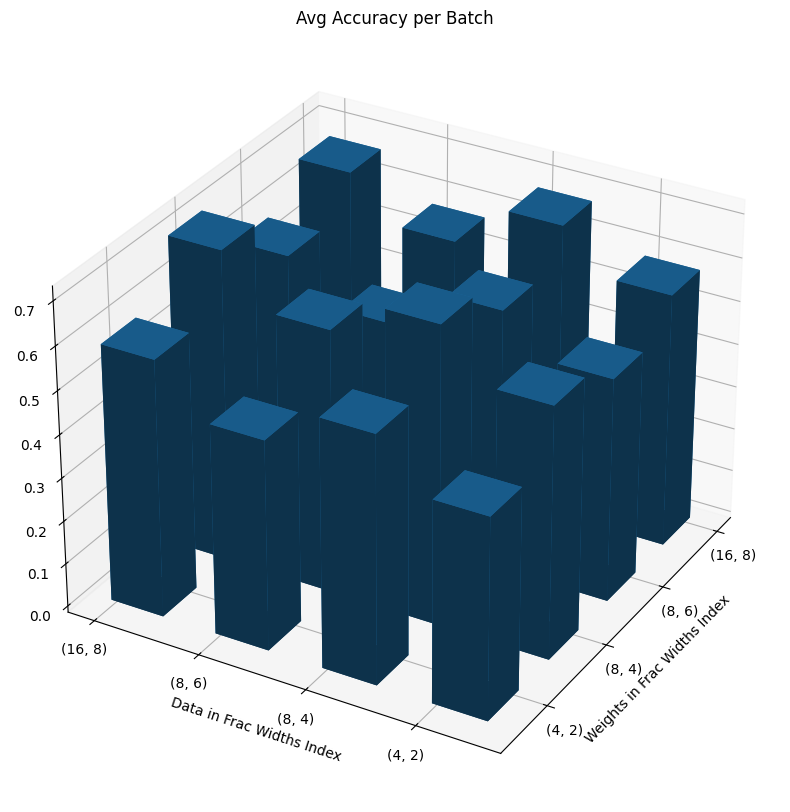

# LAB 3

### 1. Explore additional metrics that can serve as quality metrics for the search process. For example, you can consider metrics such as latency, model size, or the number of FLOPs (floating-point operations) involved in the model.
Three additional metrics which are very important to analyse are:

* **Latency** refers to the time it takes for an input to go through the model during the forward pass and produce an output - the inference time. This is a critical measurement of any model that has the intention of deployment into a real-life commercial setting. 

* **CPU/GPU Utilization** utilization can help identify how effectively a DL model uses the computational resources. High utilization rates might indicate good efficiency, whereas low utilization could suggest bottlenecks or inefficiencies in the model architecture, i.e. during synchronization and joining of threads. It also is directly proportional to power consumption which is a critical metric to understand if the model is feasible in terms of cost. By optimizing utilization, the model can achieve better performance without necessarily scaling up hardware resources, leading to cost savings.

* The number of **FLOPS** (Floating Point Operations Per Second) is calculated by the pre-defined function applied to each type of nn.module. This will correlate to both model-size and latency, although after optimization, like quantization, latency will decrease whilst FLOPS will not. FLOPS can help to understand the maximum computational capabilities of the hardware being used, and decide on hardware to be used both during training and inference.

### 2. Implement some of these additional metrics and attempt to combine them with the accuracy or loss quality metric.

The key metrics discussed in [Q1](#1-explore-additional-metrics-that-can-serve-as-quality-metrics-for-the-search-process-for-example-you-can-consider-metrics-such-as-latency-model-size-or-the-number-of-flops-floating-point-operations-involved-in-the-model
) are now implemented in addition to accuracy and loss for the search-space defined. 

In models predicting class probabilities, cross-entropy loss encourages accurate class prediction by penalizing incorrect probabilities. As loss decreases, accuracy typically increases, indicating better model performance. Cross-entropy, defined as $H(P^*, P) = -\sum_{i}{M} P^*(i) \log P(i)$, inversely mirrors accuracy measured by `MulticlassAccuracy`, which assesses overall class accuracy. Thus, only one metric is required to be measured and in this case we will use `MulticlassAccuracy`.


Firstly, a way to visualise the search space grid is written
```python
def plot_metric_search_spaces(metric, title, x_label, y_label, search_space_config_x, search_space_config_y):
    """
    This function visualizes the performance metrics of different quantization configurations as a 3D bar chart. 
    It is designed to plot metrics (like accuracy, latency, etc.) across a two-dimensional grid of quantization 
    configurations, making it easier to compare the impact of different settings on model performance. 
    The metrics are plotted against two axes representing distinct dimensions of the search space (e.g., 
    data precision and weight precision configurations).

    Inputs:
    - metric: A list or array of metric values corresponding to each quantization configuration. 
            The length should match the product of the dimensions of the search space (e.g., 16 for a 4x4 grid).
    - title: The title of the plot, typically describing the metric being visualized.
    - x_label: Label for the x-axis, describing the dimension of the quantization configurations it represents.
    - y_label: Label for the y-axis, similarly describing its corresponding quantization dimension.
    - search_space_config_x: A list of labels for the x-axis ticks, representing distinct values in the first dimension of the search space.
    - search_space_config_y: A list of labels for the y-axis ticks, representing distinct values in the second dimension of the search space.

    Outputs:
    - None. The function directly creates and displays a 3D bar chart using matplotlib. The chart illustrates 
    the given metric across different configurations defined by `search_space_config_x` and `search_space_config_y`.

    Note: This function assumes that `metric` can be reshaped into a square grid (e.g., 4x4 for 16 configurations), 
    and it uses 3D plotting capabilities of matplotlib for visualization. It is particularly useful for analyzing 
    the effects of two varying quantization parameters on model performance in a visually intuitive manner.
    """
    # Reshape the metric values to fit a 4x4 grid (since we have 16 configurations)
    grid_shape = (4, 4)  # 4 data configurations x 4 weight configurations
    metric = np.array(metric).reshape(grid_shape)

    # Create the plot
    fig = plt.figure(figsize=(12,10))
    plt.tight_layout()

    ax = fig.add_subplot(111, projection='3d')

    # Adjust grid for plotting based on the new expectation
    y, x = np.meshgrid(np.arange(grid_shape[1]), np.arange(grid_shape[0]))
    x = x.flatten()
    y = y.flatten()
    z = np.zeros(grid_shape).flatten()

    # Bar width and depth
    dx = dy = 0.5

    # Plotting the metric as a 3D bar chart
    ax.bar3d(x, y, z, dx, dy, metric.T.flatten(), shade=True)

    # Set plot labels and title
    ax.set_title(title)
    ax.set_xlabel(x_label)
    ax.set_ylabel(y_label)

    ax.set_xticks([0, 1, 2, 3])
    ax.set_yticks([0, 1, 2, 3])
    ax.set_xticklabels([str(pair) for pair in search_space_config_x])
    ax.set_yticklabels([str(pair) for pair in search_space_config_y])

    ax.view_init(elev=30, azim=30)

    # Show the plot
    plt.show()
```

Then the search space is incremented through brute force, for accuracy, loss, latency, and hardware (GPU/CPU) utilization metrics.

```python
import torch
from torchmetrics.classification import MulticlassAccuracy
import time
import subprocess
import psutil

mg, _ = init_metadata_analysis_pass(mg, None)
mg, _ = add_common_metadata_analysis_pass(mg, {"dummy_in": dummy_in})
mg, _ = add_software_metadata_analysis_pass(mg, None)
train(mg.model, model_info, data_module, data_module.dataset_info, task, optimizer, learning_rate, weight_decay, plt_trainer_args, auto_requeue, save_path, visualizer, load_name, load_type)

metric = MulticlassAccuracy(num_classes=5)
num_batchs = 5

start = torch.cuda.Event(enable_timing=True)
end = torch.cuda.Event(enable_timing=True)


def additional_metrics(mg, search_spaces, plot=True):
    """
    This function evaluates the performance of different quantization configurations on a neural network model 
    by measuring various metrics such as accuracy, loss, latency, and hardware (GPU/CPU) utilizations. 
    It iterates over a set of quantization configurations, applies each to the model, and performs inference 
    on batches of data to collect performance metrics. The function aims to provide insights into the impact 
    of quantization on model efficiency and hardware resource usage, facilitating the selection of optimal 
    quantization settings for deployment.

    Inputs:
    - mg: A model graph or model wrapper that supports quantization transformations and inference.
    - search_spaces: An iterable containing different quantization configurations to be evaluated.
    - plot (bool): Indicates whether to plot the collected metrics against the quantization configurations.

    Outputs:
    - None. The function prints average values for accuracy, loss, latency, and hardware utilizations directly. 
    If the 'plot' argument is True, it also generates plots for these metrics.
    """

    def get_gpu_power_usage():
        try:
            smi_output = subprocess.check_output(['nvidia-smi', '--query-gpu=power.draw', '--format=csv,noheader,nounits']).decode().strip()
            power_usage = [float(x) for x in smi_output.split('\n')]  # power usage in watts
            return power_usage, True
        except Exception as e:
            print(f"{e}\nNo GPU found. Monitoring CPU usuage only.")
            return [], False

    def get_cpu_utilization(): 
        try:
            cpu_utilization = psutil.cpu_percent(interval=None)
            return cpu_utilization, True
        except Exception as e:
            print(f"{e}\nNo CPU found.")
            return [], False


    # Check for GPU / CPU
    _, gpu_found = get_gpu_power_usage()
    _, cpu_found = get_cpu_utilization()

    recorded_accs = []
    recorded_losses = []
    recorded_latencies = []
    recorded_gpu_utilizations = []
    recorded_cpu_utilizations = []
    latencies = []
    cpu_tdp = 25 # Assuming a Thermal Design Power for the CPU of 25 watts

    # Brute Force Search
    for i, config in enumerate(search_spaces):
        mg, _ = quantize_transform_pass(mg, config)
        j = 0
        acc_avg, loss_avg = 0, 0
        accs, losses, gpu_power_usages, cpu_power_usages  = [], [], [], []
        
        # Runner loop
        for inputs in data_module.train_dataloader():
            xs, ys = inputs

            # Reset CPU utilization measurement
            _, _ = get_cpu_utilization()  # Call once to reset the measurement

            # Measure GPU power usage before prediction
            if gpu_found:
                gpu_power_before = sum(get_gpu_power_usage()[0])

            # Measure GPU power usage before prediction and warm up the GPU
            if gpu_found:
                gpu_power_before = sum(get_gpu_power_usage()[0])
                steps = 10

                # Warmup GPU 
                for _ in range(steps):
                    mg.model(xs) # don't record time

                start_gpu = torch.cuda.Event(enable_timing=True)
                end_gpu = torch.cuda.Event(enable_timing=True)
                start.record()

            start_time = time.time()
            preds = mg.model(xs)  # Model prediction
            end_time = time.time()
            latency_gpu = 0
            # GPU latency is measured differently to CPU latency
            if gpu_found:
                end.record()
                torch.cuda.synchronize()  # Wait for GPU operations to finish/syncronize
                latency_gpu = start_gpu.elapsed_time(end_gpu) # measured in milliseconds
                latencies.append(latency_gpu * 1.0e6)  # Convert to nanoseconds
            else:
                latencies.append((end_time - start_time) * 1.0e6)  # Convert to nanoseconds

            # Measure GPU power usage after prediction
            if gpu_found:
                gpu_power_after = sum(get_gpu_power_usage()[0])
                gpu_power_used = (gpu_power_after - gpu_power_before)  # Measured in W
                gpu_power_usages.append(gpu_power_used)

            # Measure CPU utilization and estimate power usage
            if cpu_found:
                cpu_utilization, _ = get_cpu_utilization()  # Get CPU utilization over operation duration
                estimated_cpu_power = (cpu_utilization / 100) * cpu_tdp  # Measured in W
                cpu_power_usages.append(estimated_cpu_power)

            acc = metric(preds, ys)
            accs.append(acc)
            loss = torch.nn.functional.cross_entropy(preds, ys)
            losses.append(loss)

            if j > num_batchs:
                break
            j += 1

        acc_avg = sum(accs) / len(accs)
        loss_avg = sum(losses) / len(losses)
        if cpu_found:
            avg_cpu_utilizations = sum(cpu_power_usages) / len(cpu_power_usages)
            recorded_cpu_utilizations.append(avg_cpu_utilizations)
        if gpu_found:
            avg_gpu_utilizations = sum(gpu_power_usages) / len(gpu_power_usages)
            recorded_gpu_utilizations.append(avg_gpu_utilizations)
        recorded_accs.append(acc_avg)
        recorded_losses.append(loss_avg)
        recorded_latencies.append(sum(latencies) / len(latencies))

    # Convert each tensor to a float
    recorded_accs = [tensor.item() for tensor in recorded_accs]
    recorded_losses = [tensor.item() for tensor in recorded_losses]
    avg_acc = np.mean(recorded_accs)
    print(f"Average Accuracy per Batch: {avg_acc:.4g}")

    loss_avg = np.mean(recorded_losses)
    print(f"Average Loss per Batch: {loss_avg:.4g}")

    avg_latency = np.mean(recorded_latencies)
    print(f"Average Latency per Batch: {avg_latency:.2f} nanoseconds")

    if gpu_found:
        avg_gpu_power_usage = np.mean(recorded_cpu_utilizations)
        print(f"Average GPU Power Usage per Batch: {avg_gpu_power_usage:.4g}W")
    if cpu_found:
        avg_cpu_utilization = np.mean(recorded_cpu_utilizations)
        print(f"Average CPU Power Usage per Batch: {avg_cpu_utilization:.4g}W")

    if plot:
        plot_metric_search_spaces(recorded_accs, 'Avg Accuracy per Batch', 'Weights in Frac Widths Index', 'Data in Frac Widths Index', w_in_frac_widths, data_in_frac_widths)
        plot_metric_search_spaces(recorded_losses, 'Avg Loss per Batch', 'Weights in Frac Widths Index', 'Data in Frac Widths Index', w_in_frac_widths, data_in_frac_widths)
        plot_metric_search_spaces(recorded_latencies, 'Avg Latency per Batch (ns)', 'Weights in Frac Widths Index', 'Data in Frac Widths Index', w_in_frac_widths, data_in_frac_widths)

        if gpu_found:
            plot_metric_search_spaces(recorded_gpu_utilizations, 'Avg GPU Usage per Batch (W)', 'Weights in Frac Widths Index', 'Data in Frac Widths Index', w_in_frac_widths, data_in_frac_widths)
        if cpu_found:
            plot_metric_search_spaces(recorded_cpu_utilizations, 'Avg CPU Usage per Batch (W)', 'Weights in Frac Widths Index', 'Data in Frac Widths Index', w_in_frac_widths, data_in_frac_widths)
    return
```

After passing through the `jsc-tiny` mase graph and using the search space paramters defined in `lab3.ipynb`, the following output is obtained:

```
Average Accuracy per Batch: 0.1591
Average Loss per Batch: 1.632
Average Latency per Batch: 676.12 nanoseconds
Average CPU Power Usage per Batch: 10.29W
```

<table style="width: 100%; table-layout: fixed;">
  <tr>
    <td style="padding: 10px;"></td>
    <td style="padding: 10px;"></td>
  </tr>
  <tr>
    <td style="padding: 10px;"></td>
    <td style="padding: 10px;"></td>
  </tr>
</table>

*Figure 1: Brute force search space investigating the effect of data in frac widths and weights in frac widths in terms of accuracy, latency and GPU/CPU usage.*

Accuracy showed to be very sporadic for this network due to the non-determinsitic nature of inference which is far more influential than the quantization of such a small model. Latency is significantly correlated to the frac width/data width; even though the quantization occurs during the forward pass in MASE, the latency is still higher at high frac widths/data widths. 

Even though the code measures GPU usuage by ensuring it has 'warmed up' before taking a measurement, the GPU measurement shows little correlation with the search space. For such a small model, the measurement of usage not be very accuracte since the resolution of the `psutil` and `torch.cuda.Event`. In addition other CPU processes were not controlled such as background ssh server etc. However, this strategy may produce more precise outcomes when model size increases and thus inference and model training are larger and the lower resolution of the measurements serve as less of an impact. 

### 3. Implement the brute-force search as an additional search method within the system, this would be a new search strategy in MASE.
To integrate a brute-force search in addition to a TPE based search, the following code is modified:

* In `optuna.py` the following code is appended to the switch case inside `def sampler_map(self, name)`
```python
case "brute_force":
    sampler = optuna.samplers.BruteForceSampler()
```
* In `jsc_toy_by_type.toml`, the sampler inside `search.strategy.setup` is changed from `sampler = "tpe"` to `sampler = "bruteforce"`

After running through the MASE command line interface, the following is obtained:
```
INFO     Initialising model 'jsc-tiny'...
INFO     Initialising dataset 'jsc'...
INFO     Project will be created at /home/wfp23/ADL/mase/mase_output/jsc-tiny
INFO     Loaded pytorch lightning checkpoint from /home/wfp23/ADL/mase/mase_output/Lab_1/JSC-Tiny/software/training_ckpts/best.ckpt
INFO     Loaded model from /home/wfp23/ADL/mase/mase_output/Lab_1/JSC-Tiny/software/training_ckpts/best.ckpt.
INFO     Building search space...
INFO     Search started...
/home/wfp23/ADL/mase/machop/chop/actions/search/strategies/optuna.py:57: ExperimentalWarning: BruteForceSampler is experimental (supported from v3.1.0). The interface can change in the future.
  sampler = optuna.samplers.BruteForceSampler()
 60%|█████████████▏        | 18/30 [00:18<00:12,  1.04s/it, 18.66/20000 seconds]
INFO     Best trial(s):
Best trial(s):
|    |   number | software_metrics                   | hardware_metrics                                  | scaled_metrics                               |
|----+----------+------------------------------------+---------------------------------------------------+----------------------------------------------|
|  0 |        3 | {'loss': 1.067, 'accuracy': 0.607} | {'average_bitwidth': 4.0, 'memory_density': 8.0}  | {'accuracy': 0.607, 'average_bitwidth': 0.8} |
|  1 |        5 | {'loss': 1.038, 'accuracy': 0.616} | {'average_bitwidth': 8.0, 'memory_density': 4.0}  | {'accuracy': 0.616, 'average_bitwidth': 1.6} |
|  2 |        6 | {'loss': 1.077, 'accuracy': 0.588} | {'average_bitwidth': 2.0, 'memory_density': 16.0} | {'accuracy': 0.588, 'average_bitwidth': 0.4} |
INFO     Searching is completed
```
18 searches are ran - this corresponds to the number of combinations in the search space. Interestingly, no trials were consistently acheiving the highest metrics. This is likely due to the small amounts of parameters in the `jsc-tiny` model, making it more sensitive to non-deterministic initialization as explained in [Task 2](#2-implement-some-of-these-additional-metrics-and-attempt-to-combine-them-with-the-accuracy-or-loss-quality-metric).

### 4. Compare the brute-force search with the TPE based search, in terms of sample efficiency. Comment on the performance difference between the two search methods.
Expanding the search space to a size where the BruteForce sampler cannot assess every combination makes it unable to test all possibilities. Tree-structured Parzen Estimator (TPE) is a Bayesian optimization technique; it models the probability distribution of the hyperparameters given the outcomes of previous evaluations using multivariate optimization. As, highlighted in [Figure 2](#pass-output), the TPE sampler identifies an optimal set of hyperparameters early in the process. In contrast, the brute force method struggles to uncover this optimal combination within the specified number of attempts, showcasing the TPE sampler's superiority in navigating extensive search spaces.

The effectiveness of the TPE sampler, designed for intelligent hyperparameter selection in large and complex spaces, contrasts with its performance in smaller search spaces, such as the one defined in the initial TOML file with only 18 possible combinations. Here, the advanced probabilistic modeling of the TPESampler does not significantly outperform the BruteForceSampler's exhaustive search, due to the limited number of combinations.


*Figure 2: Performance of trials vs accuracy for TPE vs Brute Force based search using the `JSC-Tiny` model.*

In this experiment, both took an equal amount of time to run (31s on a cpu). In (Optuna's documentation)[https://optuna.readthedocs.io/en/stable/reference/samplers/index.html] it recommends between 100-1000 trials for `TPESampler` to be effective over `BruteForceSampler`. This is because both samplers were not stopped early and ran through each combination. This allows TPE the to significantly outperform brute-force due to it's lower time complextity of $O(dnlog(n))$ compared to brute-force's $O(d)$ where $d$ is the dimension of the search and $n$ is the number of trials. However, TPE consistently acheived higher accuracies during early combinations due to its multivariate optimization strategy.