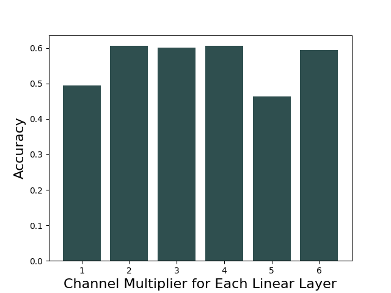
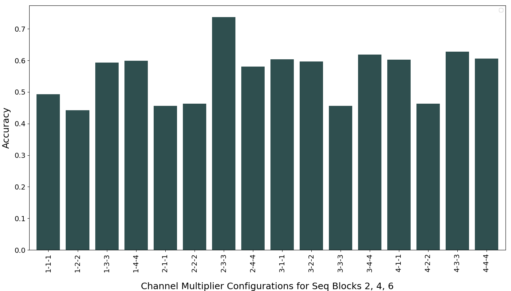

# Lab 4

### It is unusual to sequence three linear layers consecutively without interposing any non-linear activations (do you know why?)
When you stack multiple linear layers without any non-linear activations between them, the entire stack is still mathematically equivalent to a single linear layer, hence it would make sense to condense this to one layer with the same equivalent neurons.

### Q1. Can you edit your code, so that we can modify the above network to have layers expanded to double their sizes? Note: you will have to change the ReLU also.

We first 

To double the linear layers, but keeping the input and output the same, we can modify the `pass_config` as follows.
```python
model = JSC_Three_Linear_Layers()
mg = MaseGraph(model)
 
print("Original Graph:")
for block in mg.model.seq_blocks._modules:
  print(f"Block number {block}: {mg.model.seq_blocks._modules[block]}")

pass_config = {
"by": "name",
"default": {"config": {"name": None}},
"seq_blocks_2": {
    "config": {
        "name": "output_only",
        "channel_multiplier": 2,
        }
    },
"seq_blocks_4": {
    "config": {
        "name": "both",
        "channel_multiplier": 2,
        }
    },
"seq_blocks_6": {
    "config": {
        "name": "input_only",
        "channel_multiplier": 2,
        }
    },
}

mg, _ = redefine_linear_transform_pass(
    graph=mg, pass_args={"config": pass_config})


print("\nTransformed Graph:")
for block in mg.model.seq_blocks._modules:
  print(f"Block number {block}: {mg.model.seq_blocks._modules[block]}")
```
This returns
```python
Original Graph:
Block number 0: BatchNorm1d(16, eps=1e-05, momentum=0.1, affine=True, track_running_stats=True)
Block number 1: ReLU(inplace=True)
Block number 2: Linear(in_features=16, out_features=16, bias=True)
Block number 3: ReLU(inplace=True)
Block number 4: Linear(in_features=16, out_features=16, bias=True)
Block number 5: ReLU(inplace=True)
Block number 6: Linear(in_features=16, out_features=5, bias=True)
Block number 7: ReLU(inplace=True)

Transformed Graph:
Block number 0: BatchNorm1d(16, eps=1e-05, momentum=0.1, affine=True, track_running_stats=True)
Block number 1: ReLU(inplace=True)
Block number 2: Linear(in_features=16, out_features=32, bias=True)
Block number 3: ReLU(inplace=True)
Block number 4: Linear(in_features=32, out_features=32, bias=True)
Block number 5: ReLU(inplace=True)
Block number 6: Linear(in_features=32, out_features=5, bias=True)
Block number 7: ReLU(inplace=True)
```

### Q2. In [Lab 3](../lab3/lab3.md), we have implemented a grid search, can we use the grid search to search for the best channel multiplier value?
Firstly we define a simple brute force function that goes through each  set of the search spaces to record the accuracies and loss of the model and identify the best performing model.
```python
def brute_force_search(search_spaces, json_file):
    """
    This function conducts a brute force search over a set of search spaces to identify the configuration that yields the highest accuracy for a given machine learning model, specifically a model with three linear layers defined by `JSC_Three_Linear_Layers`. 

    Parameters:
    - search_spaces: A list of dictionaries, where each dictionary represents a different configuration of hyperparameters or model parameters to be tested.
    - json_file: The path to a JSON file where the results of the search (accuracy and loss for each search space) will be saved.

    The function iterates over each search space configuration, applying the configuration to the model through the `redefine_linear_transform_pass` function. This involves modifying the model's structure or parameters as specified by the `search_space` configuration.

    For each modified model configuration, the function:
    - Trains the model using predefined training parameters (not shown in the function signature).
    - Evaluates the model on a test dataset to obtain metrics such as accuracy and loss.
    - Compares the obtained accuracy with the best accuracy found so far, updating the best accuracy and best search space configuration if the current configuration outperforms the previous best.

    Finally, all results (search space configurations and their corresponding accuracy and loss) are written to the specified JSON file. The function returns the highest accuracy found and the search space configuration that achieved this accuracy.
    """
    best_accuracy = 0.0
    best_search_space = None
    results = []
    for search_space in search_spaces:
        model = JSC_Three_Linear_Layers()
        mg = MaseGraph(model)
        mg, _ = redefine_linear_transform_pass(
        graph=mg, pass_args={"config": search_space})

        print("\nTransformed Graph:")
        for block in mg.model.seq_blocks._modules:
            print(f"Block number {block}: {mg.model.seq_blocks._modules[block]}")

        train(mg.model, model_info, data_module, data_module.dataset_info, task, optimizer, learning_rate, weight_decay, plt_trainer_args, auto_requeue, save_path, visualizer, load_name, load_type)
        
        metrics = test(mg.model, model_info, data_module, data_module.dataset_info, task, optimizer, learning_rate, weight_decay, plt_trainer_args, auto_requeue, save_path, visualizer, load_name, load_type, return_metrics=True)
        print(metrics)
        accuracy = metrics[0]['test_acc_epoch']
        if accuracy > best_accuracy:
            best_accuracy = accuracy
            best_search_space = search_space

        # Append the new result to the results list
        results.append({
            "search_space": search_space,
            "accuracy": metrics[0]['test_acc_epoch'],
            "loss": metrics[0]['test_loss_epoch']
        })

    # Write the results list to the JSON file
    with open(json_file, 'w') as f:
        json.dump(results, f)

    return best_accuracy, best_search_space
```
We then build a search space and pass it into `brute_force_search`.
```python
# build a search space
channel_multipliers = [1, 2, 3, 4, 5, 6]
search_spaces = []
for multiplier in channel_multipliers:
    pass_config['seq_blocks_2']["config"]["channel_multiplier"] = multiplier
    pass_config['seq_blocks_4']["config"]['channel_multiplier'] = multiplier
    pass_config['seq_blocks_6']["config"]['channel_multiplier'] = multiplier
    search_spaces.append(deepcopy(pass_config))

# find the best accuracy and the best multipliers, json results are also stored
best_accuracy, best_search_space = brute_force_search(search_spaces, json_file="/home/wfp23/ADL/mase/docs/labs/Channel_Multiplier/channel_multiplier_search_Q2_2.json")

print(f"Best accuracy: {best_accuracy}")
print(f"Best search space: {best_search_space}")
```
The findings stored to the json can then be plotted to give insights into which channel multiplier gives the best performance


*Figure 1: Performance of different channel multipliers for each of the three linear layers in the network.*

### Q3. You may have noticed, one problem with the channel multiplier is that it scales all layers uniformly. Can you then design a search so that it can reach a network that can have this kind of structure?

The `redefine_linear_transform_pass` can be modified as follows to allow for non-uniform scaling of the layers.

```python
def redefine_linear_transform_pass(graph, pass_args=None):
    """
    This function modifies the linear layers of a given graph according to specified transformation rules. It is designed to dynamically adjust the `in_features` and/or `out_features` of linear layers based on the configuration provided in `pass_args`.

    Parameters:
    - graph: The computational graph of a model, which contains the structure and modules of the model to be transformed.
    - pass_args: A dictionary containing the transformation rules and configurations. It must include a 'config' key with sub-keys for each node that should be modified, and a 'default' configuration used for nodes not explicitly mentioned. The 'config' dictionary for each node may specify modifications in three modes:
        - "output_only": Multiplies `out_features` by a specified factor.
        - "input_only": Multiplies `in_features` by a specified factor.
        - "both": Multiplies both `in_features` and `out_features` by specified factors (potentially different for each).

    The function iterates over all nodes in the `graph.fx_graph.nodes` structure. For each node, it looks up the transformation configuration, either the specific one if the node's name is mentioned in `pass_args['config']` or the default one otherwise. Based on this configuration, it adjusts the `in_features`, `out_features`, or both for the linear module associated with the node. It then creates a new linear module with these modified dimensions and replaces the original module in the graph with this new module.

    The function raises a ValueError if the 'default' configuration is not provided in `pass_args`.

    Returns:
    - The modified graph with updated linear modules according to the provided configurations.
    - An empty dictionary, which could potentially be used for returning additional metadata in future extensions of this function.
    """
    main_config = pass_args.pop('config')
    default = main_config.pop('default', None)
    if default is None:
        raise ValueError(f"default value must be provided.")
    i = 0
    for node in graph.fx_graph.nodes:
        i += 1
        # if node name is not matched, it won't be tracked
        config = main_config.get(node.name, default)['config']
        name = config.get("name", None)
        if name is not None:
            ori_module = graph.modules[node.target]
            in_features = ori_module.in_features
            out_features = ori_module.out_features
            bias = ori_module.bias
            if name == "output_only":
                out_features = out_features * config["channel_multiplier"]
            elif name == "both":
                in_features = in_features * config["channel_multiplier_in"]
                out_features = out_features * config["channel_multiplier_out"]
            elif name == "input_only":
                in_features = in_features * config["channel_multiplier"]
            new_module = instantiate_linear(in_features, out_features, bias)
            parent_name, name = get_parent_name(node.target)
            setattr(graph.modules[parent_name], name, new_module)
    return graph, {}
```
We then build a new search space and pass it into `brute_force_search` as before.
```python
channel_multipliers = [1, 2, 3, 4]
search_spaces = []
for channel_multiplier_1 in channel_multipliers:
  for channel_multiplier_2 in channel_multipliers:
    pass_config['seq_blocks_2']['config']['channel_multiplier'] = channel_multiplier_1
    pass_config['seq_blocks_4']['config']['channel_multiplier_in'] = channel_multiplier_1
    pass_config['seq_blocks_4']['config']['channel_multiplier_out'] = channel_multiplier_2
    pass_config['seq_blocks_6']['config']['channel_multiplier'] = channel_multiplier_2
    search_spaces.append(deepcopy(pass_config))

# find the best accuracy and the best multiplier, json results are also stored
best_accuracy, best_search_space = brute_force_search(search_spaces, json_file="/home/wfp23/ADL/mase/docs/labs/Channel_Multiplier/channel_multiplier_search_Q3.json")

print(f"Best accuracy: {best_accuracy}")
print(f"Best search space: {best_search_space}")
```
Simarly, the findings are then plotted to give insights into which channel multiplier gives the best performance



*Figure 2: Performance of different channel multipliers for each linear layer combination.*

### Q4. Integrate the search to the chop flow, so we can run it from the command line.
Similar to the quantize transform, we define a new transform located in graph transform directory of mase: `mase/machop/chop/passes/graph/transforms/channel_modifier/modify.py`. The `redefine_transform_pass` method transforms the graph's channel mutlipliers based on the toml configuration, so that the input and output linear layers can be multiplied acccordingly and the batch norm and activation functions will be adjusted automatically. The fucntion is as follows:

```python
def redefine_transform_pass(graph, pass_args=None):
    """
    Redefines the transformation pass of a given graph based on specific configuration parameters.

    :param graph: The input graph to be transformed.
    :type graph: MaseGraph

    :param pass_args: Additional arguments for the transformation, including configuration details for each layer.
    :type pass_args: dict, optional

    :return: The transformed graph along with an empty dictionary (placeholder for future use).
    :rtype: tuple

    :raises ValueError: If the default configuration is not provided in `pass_args`.

    This function iterates through each node in the graph's function representation (fx_graph). It applies transformation
    passes according to the configuration provided in `pass_args`. These transformations include redefining linear, ReLU,
    and BatchNorm1d layers with new parameters. The function ensures that the transformations are applied correctly by
    adjusting parameters such as input/output features and layer-specific configurations based on the node's characteristics
    and the provided configuration. The transformation logic includes handling for different naming schemes and
    adjustments based on previous layer configurations to ensure consistency in the transformed graph. It is essential
    to provide a default configuration in `pass_args` to avoid a ValueError.
    """
    def create_linear_layer(in_features, out_features, bias):
        # Creates a linear layer for a neural network with specified input/output features and bias option.
        if bias is not None:  # Ensures bias is explicitly enabled if provided; this condition is ineffective due to logic error.
            bias = True
        return nn.Linear(
            in_features=in_features,
            out_features=out_features,
            bias=bias)  # Returns an instance of the linear layer.

    def create_relu_inplace(inplace):
        # Returns a ReLU (Rectified Linear Unit) activation layer, with an option to do the operation in-place.
        return ReLU(inplace)  # Inplace determines if the input tensor is modified directly.

    def create_batchnorm_1d_layer(num_features, eps, momentum, affine, track_running_stats):
        # Initializes a 1D batch normalization layer with specific parameters.
        return nn.BatchNorm1d(num_features, eps, momentum, affine, track_running_stats)  # Returns an instance of BatchNorm1d.
    
    main_config = pass_args.pop('config')

    default = main_config.pop('default', None)

    if default is None:
        raise ValueError(f"default value must be provided.")
    i = 0
    pre_in = 1
    pre_out = 1
    for node in graph.fx_graph.nodes:
        i += 1
        # if node name is not matched, it won't be tracked
        config = main_config.get(node.name, default)['config']
        name = config.get("name", None)
        
        actual_target = get_node_actual_target(node)
        # Process Linear layers
        if isinstance(actual_target, nn.Linear):
            if name is not None:
                if node.target=='x' or node.target=='output':
                    continue
                ori_module = graph.modules[node.target]
                in_features = config.get('in_features', 16)
                out_features = config.get('out_features', 16)
                bias = ori_module.bias
                if name == "output_only":
                    in_features = ori_module.in_features
                    out_features = out_features * config["channel_multiplier"]
                    pre_out=config["channel_multiplier"]
                elif name == "both":
                    in_features = in_features * pre_out
                    out_features = out_features * config["channel_multiplier"]
                    pre_out = pre_in
                    pre_in = config["channel_multiplier"]
                elif name == "input_only":
                    in_features = in_features * pre_in
                    out_features = ori_module.out_features
                new_module = create_linear_layer(in_features, out_features, bias)
                parent_name, name = get_parent_name(node.target)
                setattr(graph.modules[parent_name], name, new_module)
            
        # Process ReLU layers
        elif isinstance(actual_target, ReLU):
            name = config.get("name")
            if name:
                ori_module = graph.modules[node.target]
                new_module = create_relu_inplace(ori_module.inplace)
                setattr(graph.modules[node.target], "inplace", new_module.inplace)
        
        # Process BatchNorm1d layers
        elif isinstance(actual_target, nn.BatchNorm1d):
            name = config.get("name")
            if name:
                ori_module = graph.modules[node.target]
                # Instantiate a new BatchNorm1d with the original module's parameters
                new_module = create_batchnorm_1d_layer(
                    ori_module.num_features, ori_module.eps, ori_module.momentum, 
                    ori_module.affine, ori_module.track_running_stats)
                parent_name, child_name = get_parent_name(node.target)
                setattr(graph.modules[parent_name], child_name, new_module)           
    return graph, {}
```

Similar to the quantization search space, we define a new search space of Class `ChannelSizeModifier` located in `mase/machop/chop/actions/search/search_space/channel_modifier/graph.py`. This includes the same methods as quantization such as `_post_init_setup`, `rebuild_model`, `build_search_space` and `flattened_indexes_to_config` with minor changes to deep-copy the graph and call the `redefine_transform_pass`.
```python
# This is the search space for mixed-precision post-training-quantization quantization search on mase graph.
from copy import deepcopy
from torch import nn
from ..base import SearchSpaceBase
from .....passes.graph.transforms.channel_modifier import (
    CHANNEL_OP,
    redefine_transform_pass,
)

from .....ir.graph.mase_graph import MaseGraph
from .....passes.graph import (
    init_metadata_analysis_pass,
    add_common_metadata_analysis_pass,
)
from .....passes.graph.utils import get_mase_op, get_mase_type, get_node_actual_target, get_parent_name
from ..utils import flatten_dict, unflatten_dict
from collections import defaultdict
import torch


DEFAULT_CHANNEL_MODIFIER_CONFIG = {
    "config": {
        "name": None,
        "channel_multiplier": 1,
        }
    }

class ChannelSizeModifier(SearchSpaceBase):
    """
    Pre-Training search space for modifying channel size on mase graph.
    """

    def _post_init_setup(self):
        self.model.to("cpu")  # save this copy of the model to cpu
        self.mg = None
        self._node_info = None
        self.default_config = DEFAULT_CHANNEL_MODIFIER_CONFIG

    def rebuild_model(self, sampled_config, is_eval_mode: bool = True):
        # set train/eval mode before creating mase graph
        if is_eval_mode:
            self.model.eval()
        else:
            self.model.train()

        assert self.model_info.is_fx_traceable, "Model must be fx traceable"
        mg = MaseGraph(self.model)
        mg, _ = init_metadata_analysis_pass(mg, None)
        mg, _ = add_common_metadata_analysis_pass(
            mg, {"dummy_in": self.dummy_input, "force_device_meta": False}
        )
        if sampled_config is not None:
            mg, _ = redefine_transform_pass(mg, {"config": sampled_config})
        mg.model.to(self.accelerator)
        return mg

    def build_search_space(self):
        """
        Build the search space for the mase graph (only channel modifier ops)
        """
        # Build a mapping from node name to mase_type and mase_op.
        mase_graph = self.rebuild_model(sampled_config=None, is_eval_mode = False)
        node_info = {}
        for node in mase_graph.fx_graph.nodes:
            node_info[node.name] = {
                "mase_type": get_mase_type(node),
                "mase_op": get_mase_op(node),
            }
        # Build the search space
        choices = {}
        seed = self.config["seed"]

        match self.config["setup"]["by"]:
            case "name":
                # iterate through all the channel modifier nodes in the graph
                # if the node_name is in the seed, use the node seed search space
                # else use the default search space for the node
                for n_name, n_info in node_info.items():
                    if n_info["mase_op"] in CHANNEL_OP:
                        if n_name in seed:
                            choices[n_name] = deepcopy(seed[n_name])
                        else:
                            choices[n_name] = deepcopy(seed["default"])
            case _:
                raise ValueError(
                    f"Unknown channel multiplier by: {self.config['setup']['by']}"
                )

        # flatten the choices and choice_lengths
        flatten_dict(choices, flattened=self.choices_flattened)
        self.choice_lengths_flattened = {
            k: len(v) for k, v in self.choices_flattened.items()
        }
        
    def flattened_indexes_to_config(self, indexes: dict[str, int]):
        """
        Convert sampled flattened indexes to a nested config which will be passed to `rebuild_model`.
        """
        flattened_config = {}
        for k, v in indexes.items():
            flattened_config[k] = self.choices_flattened[k][v]

        config = unflatten_dict(flattened_config)
        config["default"] = self.default_config
        config["by"] = self.config["setup"]["by"]
        return config
# This is the search space for mixed-precision post-training-quantization quantization search on mase graph.
from copy import deepcopy
from torch import nn
from ..base import SearchSpaceBase
from .....passes.graph.transforms.channel_modifier import (
    CHANNEL_OP,
    redefine_transform_pass,
)

from .....ir.graph.mase_graph import MaseGraph
from .....passes.graph import (
    init_metadata_analysis_pass,
    add_common_metadata_analysis_pass,
)
from .....passes.graph.utils import get_mase_op, get_mase_type, get_node_actual_target, get_parent_name
from ..utils import flatten_dict, unflatten_dict
from collections import defaultdict
import torch


DEFAULT_CHANNEL_MODIFIER_CONFIG = {
    "config": {
        "name": None,
        "channel_multiplier": 1,
        }
    }

class ChannelSizeModifier(SearchSpaceBase):
    """
    Pre-Training search space for modifying channel size on mase graph.
    """

    def _post_init_setup(self):
        self.model.to("cpu")  # save this copy of the model to cpu
        self.mg = None
        self._node_info = None
        self.default_config = DEFAULT_CHANNEL_MODIFIER_CONFIG

    def rebuild_model(self, sampled_config, is_eval_mode: bool = True):
        # set train/eval mode before creating mase graph
        if is_eval_mode:
            self.model.eval()
        else:
            self.model.train()

        assert self.model_info.is_fx_traceable, "Model must be fx traceable"
        mg = MaseGraph(self.model)
        mg, _ = init_metadata_analysis_pass(mg, None)
        mg, _ = add_common_metadata_analysis_pass(
            mg, {"dummy_in": self.dummy_input, "force_device_meta": False}
        )
        if sampled_config is not None:
            mg, _ = redefine_transform_pass(mg, {"config": sampled_config})
        mg.model.to(self.accelerator)
        return mg

    def build_search_space(self):
        """
        Build the search space for the mase graph (only channel modifier ops)
        """
        # Build a mapping from node name to mase_type and mase_op.
        mase_graph = self.rebuild_model(sampled_config=None, is_eval_mode = False)
        node_info = {}
        for node in mase_graph.fx_graph.nodes:
            node_info[node.name] = {
                "mase_type": get_mase_type(node),
                "mase_op": get_mase_op(node),
            }
        # Build the search space
        choices = {}
        seed = self.config["seed"]

        match self.config["setup"]["by"]:
            case "name":
                # iterate through all the channel modifier nodes in the graph
                # if the node_name is in the seed, use the node seed search space
                # else use the default search space for the node
                for n_name, n_info in node_info.items():
                    if n_info["mase_op"] in CHANNEL_OP:
                        if n_name in seed:
                            choices[n_name] = deepcopy(seed[n_name])
                        else:
                            choices[n_name] = deepcopy(seed["default"])
            case _:
                raise ValueError(
                    f"Unknown channel multiplier by: {self.config['setup']['by']}"
                )

        # flatten the choices and choice_lengths
        flatten_dict(choices, flattened=self.choices_flattened)
        self.choice_lengths_flattened = {
            k: len(v) for k, v in self.choices_flattened.items()
        }
        
    def flattened_indexes_to_config(self, indexes: dict[str, int]):
        """
        Convert sampled flattened indexes to a nested config which will be passed to `rebuild_model`.
        """
        flattened_config = {}
        for k, v in indexes.items():
            flattened_config[k] = self.choices_flattened[k][v]

        config = unflatten_dict(flattened_config)
        config["default"] = self.default_config
        config["by"] = self.config["setup"]["by"]
        return config
```

Next we add a physicial model to mase named `jsc-three-linear-layers` using the same methodlogy as used in Lab 1 for `jsc-will`. Then we create the toml file named `jsc_three_linear_layers_ch_multi.toml` that will tune the model using Optuna's `TPESampler`. The transform pass is designed so that channel mutlipliers can be added to the `search.search_space` tree where the original input and output sizes of each layer are predefined.
```toml
model = "jsc-three-linear-layers"
dataset = "jsc"
task = "cls"

max_epochs = 50
batch_size = 256
learning_rate = 5e-3
accelerator = "cpu"
project = "jsc-three-linear-layers"
seed = 0
log_every_n_steps = 5
load_name = "/home/wfp23/ADL/mase/machop/Three-linear-layers/jsc-three-linear-layers_classification_jsc_2024-02-08/software/training_ckpts/best.ckpt"
load_type = "pl"

[search.search_space]
name = "graph/quantize/channel_size_modifier"

[search.search_space.setup]
by = 'name'

[search.search_space.seed.default.config]
name = ["NA"]
channel_multiplier = [1, 2, 3, 5]

[search.search_space.seed.seq_blocks_2.config]
name = ["output_only"]
channel_multiplier = [1, 2, 3, 5]
in_features = [16]
out_features = [16]

[search.search_space.seed.seq_blocks_4.config]
name = ["both"]
in_features = [16]
out_features = [16]
channel_multiplier = [1, 2, 3, 5]

[search.search_space.seed.seq_blocks_6.config]
name = ["input_only"]
in_features = [16]
out_features = [16]
channel_multiplier = [1, 2, 3, 5]

[search.strategy]
name = "optuna"
eval_mode = false

[search.strategy.sw_runner.basic_evaluation]
data_loader = "val_dataloader"
num_samples = 512

[search.strategy.sw_runner.basic_train]
name = "accuracy"
data_loader = "train_dataloader"
num_samples = 1000000
max_epochs = 10
lr_scheduler = "linear"
optimizer = "adam"
learning_rate = 1e-4
num_warmup_steps = 0

[search.strategy.hw_runner.average_bitwidth]
compare_to = 32 # compare to FP32

[search.strategy.setup]
n_jobs = 1
n_trials = 20
timeout = 20000
sampler = "tpe"
sum_scaled_metrics = true # single objective
direction = "maximize"

[search.strategy.metrics]
accuracy.scale = 1.0
accuracy.direction = "maximize"
```
Despite the `eval_mode` of `search.strategy` was set to `false`, the model did not train by itself. This is due to current limitations with MASE's `train.py`. Firstly, the method `get_optimizer` assumes a model that is not a mase graph, therefore to account for this a check is made as such:
```python
    from chop.ir.graph.mase_graph import MaseGraph 
    if isinstance(model, MaseGraph):
        model = model.model 
```
Additionally inside `RunnerBasicTrain::_setup_metric` there is no check for a physical model, which `jsc-three-linear-layers` is. Therefore this is added to the same logic of `vision_model` since the same setup metric can be applied:
```python
def _setup_metric(self):
    if self.model_info.is_vision_model or self.model_info.is_physical_model:
        match self.task:
.
.
.
```
Additionally `RunnerBasicTrain::forward` also needed to be modified so that the classification could be made for physical models. A new method `physical_cls_forward` was made to calculate loss and accuracy and return it. This was then called during the `forward` method. 
```python
def physical_cls_forward(self, batch, model):
    x, y = batch[0].to(self.accelerator), batch[1].to(self.accelerator)
    loss = torch.nn.functional.cross_entropy(model(x), y)
    acc = self.metric(model(x), y)
    self.loss(loss)
    return {"loss": loss, "accuracy": acc}


def forward(self, task: str, batch: dict, model):
.
.
.
    elif self.model_info.is_physical_model:
        match self.task:
            case "classification" | "cls":
                loss = self.physical_cls_forward(batch, model)
            case _:
                raise ValueError(f"task {self.task} is not supported.")
```

Finally, the channel modifier inside chop can be run using the command:
` ./ch search --config configs/examples/jsc_three_linear_layers_ch_multi.toml`
Which gives the following output:
```
INFO     Initialising model 'jsc-three-linear-layers'...
INFO     Initialising dataset 'jsc'...
INFO     Project will be created at /home/wfp23/ADL/mase/mase_output/jsc-three-linear-layers
INFO     Loaded pytorch lightning checkpoint from /home/wfp23/ADL/mase/machop/Three-linear-layers/jsc-three-linear-layers_classification_jsc_2024-02-08/software/training_ckpts/best.ckpt
INFO     Loaded model from /home/wfp23/ADL/mase/machop/Three-linear-layers/jsc-three-linear-layers_classification_jsc_2024-02-08/software/training_ckpts/best.ckpt.
INFO     Building search space...
INFO     Search started...
  0%|                                                                                                                                                                                                                                         | 0/20 [00:00<?, ?it/s
Best trial: 0. Best value: 0.417989:   5%|████████▎                                                                                                                                                              | 1/20 [00:21<06:54, 21.82s/it, 21.82/20000 seconds]
Best trial: 0. Best value: 0.417989:  10%|████████████████▋                                                                                                                                                      | 2/20 [00:43<06:28, 21.60s/it, 43.27/20000 seconds]
```
The ouput of this search is stored to `mase/mase_output/jsc-three-linear-layers/software/search_ckpts/log.json` and can be used to visualise which channel multiplier combinations are best suited for this model as demonstrated in [Q3](#q3-you-may-have-noticed-one-problem-with-the-channel-multiplier-is-that-it-scales-all-layers-uniformly-can-you-then-design-a-search-so-that-it-can-reach-a-network-that-can-have-this-kind-of-structure).

### Optional task: (scaling the search to real networks)
Due to the time taken to modify the `train.py` search strategy runner, there was insufficient time to complete this task. However, the same strategy applied in [Q4](#q4-integrate-the-search-to-the-chop-flow-so-we-can-run-it-from-the-command-line) could be implemented to a model such as VCGNet:
* Create a new model and implement it as a vision model into MASE.
* Modify the `redefine_transform_pass` that accounts for additional layers such as convolutional and pooling layers.
* Implement a new search space graph like `ChannelSizeModifier` that calls the new `redefine_transform_pass`. Only a few changes will need to be made.
* Implement the `vision_cls_forward` method iniside `train.py` which would be similar to the `physical_cls_forward` method.
* Define an appropriate toml that works with the transform pass.